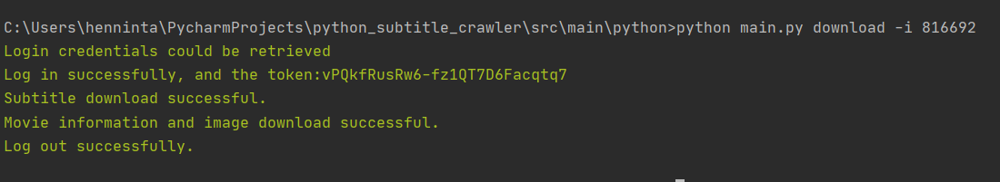

### This is a project from Tassilo Henninger for the Data Science Master class "advanced software engineering" at the Berliner Hochschule für Technik (BHT) ###

#### Explanation of the project ####
I created a command line tool for downloading subtitles and additional information regarding the movie.

You need a valid OpenSubtitles account for the tool to work.
You can register a free account at https://www.opensubtitles.org/de/newuser .
By default you are using opensubtitle agent "TemporaryUserAgent" which is limited in downloading. 
You can request your own agent at https://trac.opensubtitles.org/projects/opensubtitles/wiki/DevReadFirst .

#### Commands ####
- access help: python main.py --help
- setup config: python main.py config
- after the config is created, you can add an agent in line 3 of the config file
- check server status of OpenSubtitles: python main.py status
- download movies:
    - to see the detailed help type: python main.py download --help
    - you can download one or several subtitles in different languages. You need to provide the movie imdbid and optionally a language code, default "eng".
    - To download multiple subtitle at once, you can provide an .csv file of imdb ids inside /data/input/.
    - Here are three examples:
     1. python main.py download -i 816692 -lang
     2. python main.py download -i 343818 -lang "ger"
     3. python main.py download -li "imdb_ids"
    - Two found subitles for one movie will be saved in /data/downloads/imdbid/ with the following files.
        - subtitleid.gz zipped file
        - subtitleid.txt clear text
        - subtitleid.json movie meta info from opensubtitle
        - moviename.jpg movie cover image from imdb
        - moviename.json movie meta info from imdb

 
#### 1. Use and understand **Git!** ####
Look around here in the version control ;)
#### 2. **UML** at least **3** good diagrams. "good" means you can pump it up artificially as written in DDD. You have 10 million $ from me! Please export the pics. I can not install all tools to view them! ####
I modelled the following three diagrams:
- The Use Case Diagram shows the use interactions with the Movie Learning App. There are no other actors except the "Background System" which ensures the data preparation process. 
  - [Use Case Diagram](docs/uml/use_case_diagram.svg)
- The Deployment Diagram shows the physical deployment of the Movie Learning App. The app has three different client versions. One webapp, one desktop app and one for the native mobile devices. The backend consists of multiple services. The main services are the "Learning Service" which covers the tracking of the learned vocabs for a user and a movie and the "User Service" which handles the authentifikation/registration as well as the subscription of the users. The backend also fetches data from the three APIs: TranslationAPI, SubtitleAPI and IMDBAPI.
  - [Deployment Diagram](docs/uml/deployment_diagram.svg)
- The Activity Diagram shows the workflow of the learning process. A user starts by logging in, selecting whether he wants to learn offline or online and then starts the actual learning process. 
  - [Activity Diagram](docs/uml/activity_diagram.svg)

#### 3. **DDD** If your domain is too small, invent other domains around and document these domains (as if you have 10 Mio € from Edlich-Investment!) Develop a clear strategic design with mappings/relationships with 5-0 Domains. It would be nice if these domains are derived from an Event-Storming (but not mandatory). ####
I started the DDD approach by doing a event storming to figure all domain events out and therefore all domains for my app. Then I combined the related subdomains to the larger domains and modeled their relationships. Furthermore I created the core domain chart and placed every domain in their category (core, supporting or generic).
- [Event Storming](docs/ddd/event_storming_domains.pdf)
- [Domain and Subdomain Relationships](docs/ddd/domains_and_sub_domains_core_domain_chart.pdf)
- [Core Domain Chart](docs/ddd/domains_and_sub_domains_core_domain_chart.pdf)
#### 4. **Metrics** at least two. Sonarcube would be great. Other non trivial metrics are also fine. ####
I installed sonarqube and it concluded the follwing results. I didnt get it to work out the coverage, therefore i use the python coverage package:
- [Sonarqube Overview](docs/metrics/sonarqube.PNG)
- 0 Bugs 
- 0 Vulnerabilities
- 7 Code Security Hotspots: After manual assessment, they are all no security vulnerability. They are all http request to the opensubtitle [xmlrpc api](docs/metrics/code_smell_example6.PNG). As to date there is not https api available.
- 15 Code Smells: After manual assessment the codesmells are also misleading: 
    - [abstract class](docs/metrics/code_smell_example.PNG): the abstract class is with an pass statement defined in python
    - [method init](docs/metrics/code_smell_example2.PNG): the init method had to many parameters, or the default definition if empty is not liked from sonarqube. Even        though it is completly vaild.
    - [empty code](docs/metrics/code_smell_example3.PNG): i plan to keep on working on this project, therefore i left the method header 
    - [empty code](docs/metrics/code_smell_example5.PNG)same reason for the out commented method 
- Debt of 1h 28min, mainly of the explained things in Code Smells
- [Coverage report: 76%](docs/metrics/htmlcov/index.html) for the html to render the project needs to be downloaded.

#### 5. **Clean Code Development:** at least **5** points you can show me + >>10 points on your **personal cheat sheet** ####
My personal cheat sheet is [here](docs/cleanCode/clean_code_cheat%20sheet.pdf). From there i applied the following elements:
- Don´t Repeat Yourself (DRY). This can e.g. be seen in the [main.py](src/main/python/main.py#L98) line 98 and following at "print_result_to_console()". First i started out by using the print command "click.secho(self.message, fg="green", bold=True) if self.successful else click.secho(self.message, fg="red", bold=True)" in each line. That is a lot of repetition. Then i created a extra method for that, but i got in trouble with different response types.
- Therefore i decided to create an extra [Command Response](src/main/python/utils/command_response.py) class which handels the type and the print statement. Therefore i could also use the nice method chaining as you can [see](src/main/python/main.py#L98). This also corresponds with the Single Responsibility Principle (SRP). 
- I also made use of abstract classes for the [subtitle scraper](abstractClasses/subtitleScraper.py) and the [media scraper](abstractClasses/mediaMetaScraper.py). Therefore i defined which methods the inherited class needs to implement and can later switch out e.g. the opendsubtitle api for an other api provide more easily.
- I also used [method extracting](src/main/python/subtitle_crawler/openSubtitleCrawler.py#L83) for cleaner readable code, or [here](src/main/python/subtitle_crawler/openSubtitleCrawler.py#L141).
- Based on the method extracting principle i was able to use the mock principle. I could patch the [download_subtitle_from_proxy](src/unittest/python/download_subtitles_tests.py#L17) method an provide the appropriate [mockup](src/unittest/python/fixtures.py#L9).
- Because python does not enforce function and variable type annotations, but i find this principle really helpful, i added [type hints](src/main/python/media_crawler/imdbCrawler.py#L30) in the entire project.
- I also used the principle of only commenting the necessary things. Anything else should be clear by a good coding structure. I did that by using the [python docstring](src/main/python/subtitle_crawler/openSubtitleCrawler.py#L15) feature. Therefore i explain the purpose of every class and method in this project which is then also used by the python help() function. 
- [Method naming](src/main/python/subtitle_crawler/openSubtitleCrawler.py#L118) is particular relevant for better code readability.  
- [Information Hiding Principle](src/main/python/subtitle_crawler/openSubtitleCrawler.py#L83) by making use of private functions which cannot be called from outside.
- Using [custom error classes](src/main/python/error_classes/open_subtitle_errors.py) for better error handling. Therefore you can better distinguish between errors and treat them differently.
Abstract Classes: to define the interface and so that we could switch out the opensubtitlescrapter with another scraper
#### 6. **Build Management** with any Build System as Ant, Maven, Gradle, etc. (only Travis is perhaps not enough) Do e.g. generate Docs, call tests, etc. ####
I used pybuilder as a build management tool. With the build manager i generate my [uml diagrams](build.py#53) via plantuml, call the unittests and make sure every [required package](build.py#38) is installed.
Here you can see the [successful build](docs/buildManager/pybuilder.PNG).
#### 7. Integrate some nice **Unit-Tests** in your Code to be integrated into the Build ####
I created 5 unit tests for the subtitle scraper. In unittests it is important that we are in a controlled environment so that we can really test our one code.
But my scraper relies on fetching data and from external APIs, therefore i created several mock responses for unit testing. 
- [Mocks/Fixtures](src/unittest/python/fixtures.py)
- [5 Unittests](src/unittest/python/download_subtitles_tests.py)
#### 8. **Continuous Delivery:** show me your pipeline in e.g. Jenkins, Travis-CI, Circle-CI, GitHub Action, GitLab CI, etc. ####
I used Jenkins for coninuous delivery. First I had troubles configuring the right [working directory](docs/jenkins/Jenkins_5.JPG), but after that i was able to build the project successfully as you can see in the following screenshots [project overview](docs/jenkins/Jenkins_1.JPG), [build output 1](docs/jenkins/Jenkins_2.JPG), [build output 2](docs/jenkins/Jenkins_3.JPG), [build](docs/jenkins/Jenkins_4.JPG).
I included the following script calls:
  - first I trigger the [pybuilder build](docs/jenkins/Jenkins_6.JPG)
  - than I [send an email](docs/jenkins/Jenkins_7.JPG) after successful build via a [python script](send_mail.py)
  - first i also wanted to generate the UML documentation from jenkins, but than decided to do that in pybuilder instead.
#### 9. Use a good **IDE** and get fluent with it as e.g. IntelliJ. What are your favorite **Key-Shortcuts**?! ####
I used the pycharm IDE for this project as you can see e.g. from the screenshot from [build management](docs/buildManager/pybuilder.PNG).
My favorite things and shortcuts are the following:
  - the [rendered view](docs/pycharm/readme_rendering.png) of the readme.md is nice.
  - configure commands in the [debug configuration](docs/pycharm/debug_configuration.png)
  - block comment (control + umschalt + #)
  - Refactor this (control + alt+ umschalt +T)
  - Run (F10)
#### 10. **DSL** Create a small DSL Demo example snippet in your code even if it does not contribute to your project ####
I used the following small examples of domain-specific language patterns.
  - I used [method chaining](src/main/python/main.py#L98) which follows the fluent interface principle
  - I created a [command line interface](docs/tutorial/CLI.png) with the python package click. This enables the user to check the server status, configure a user and download subtitles.
    He also gets [visual feedback](docs/tutorial/response_message.png) via color if the command was successful or not. 
#### 11. **Functional Programming** (prove that you have covered all functional aspects in your code as ####
I came up with the [FP example](functional_programming_example.py) to check whether a subtitleId is already downloaded or not.
I only use final data structures, mostly side effect free functions, an anonymous lambda function and also provides a function as an argument. I also only use higher-order functions (map instead of foreach).
